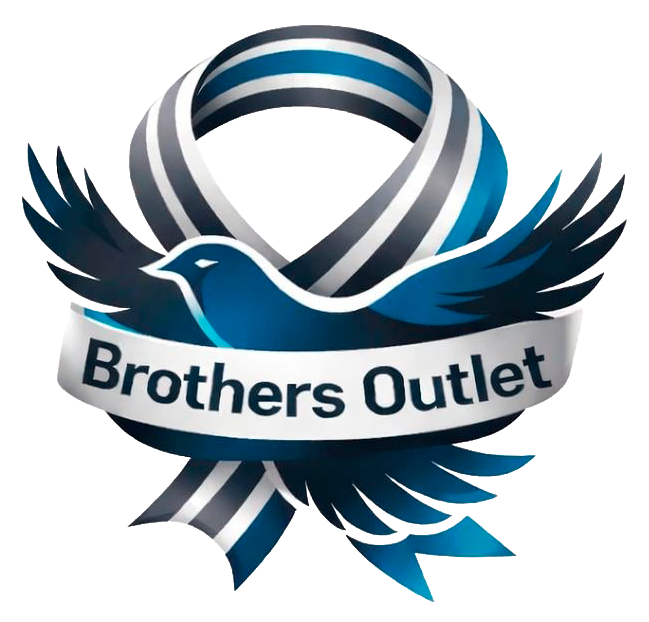

  
  <h1>Brothers Outlet — Sua Loja Online</h1>
  
Guia simples para entender o que foi desenvolvido para você.

---

## O que é esse projeto?

É o **site completo da Brothers Outlet** — uma loja virtual de moda pronta para receber clientes, exibir produtos e processar pedidos. Foi desenvolvido com tecnologias modernas, garantindo que o site seja **rápido, bonito e funcione bem em celular e computador**.

---

## O que o site tem?

### 🛍️ Loja para os seus clientes

- **Página inicial** com banner principal, ofertas em destaque, categorias de produtos e marcas parceiras
- **Carrossel de ofertas** — no celular, as promoções aparecem em slideshow automático
- **Produtos em destaque** com imagem, preço, desconto e botão de adicionar ao carrinho
- **Lista de desejos** — o cliente pode salvar produtos favoritos
- **Perguntas frequentes (FAQ)** com as dúvidas mais comuns respondidas
- **Rodapé completo** com links úteis e informações da loja

### 🛒 Carrinho e Compra

- O cliente adiciona produtos ao carrinho e pode ver tudo antes de finalizar
- Página de **checkout** para inserir dados e finalizar o pedido
- Cálculo automático de total, descontos e resumo do pedido

### 🔐 Área do Cliente

- **Cadastro e login** para o cliente ter uma conta na loja
- Após logado, o cliente pode acompanhar seus **pedidos**

### ⚙️ Painel Administrativo (para você, dono da loja)

- **Dashboard** com visão geral da operação
- Gestão de **pedidos** recebidos
- Gestão de **produtos** (adicionar, editar, remover)
- Gestão de **usuários/clientes** cadastrados

---

## Como o site aparece para o cliente?

| Dispositivo       | Experiência                                                                              |
| ----------------- | ---------------------------------------------------------------------------------------- |
| 📱 **Celular**    | Layout adaptado, menu hamburguer, carrossel de ofertas, ícone do carrinho sempre visível |
| 💻 **Computador** | Layout completo com todos os menus visíveis, grade de produtos em 3 colunas              |
| 📟 **Tablet**     | Versão intermediária, totalmente funcional                                               |

---

## Identidade visual aplicada

- **Logo** da Brothers Outlet em todas as páginas (topo e rodapé)
- **Cor azul aço** (`#1565a0`) como cor principal em botões, destaques e badges
- **Tipografia moderna** com a fonte Mona Sans
- Visual limpo, profissional e alinhado com o segmento de moda

---

## O que precisa ser feito para ir ao ar?

Para o site funcionar de verdade para os seus clientes, ainda são necessários os seguintes passos:

1. **Contratar uma hospedagem** — indicamos a [Vercel](https://vercel.com) (gratuita para começo) ou qualquer servidor que suporte Node.js
2. **Conectar ao backend/API** — o site precisa de uma API que forneça os produtos, pedidos e usuários reais (podemos desenvolver isso juntos)
3. **Cadastrar os produtos** — inserir fotos, nomes, preços e categorias reais
4. **Configurar domínio** — apontar o endereço `brothersoutlet.com.br` (ou outro) para a hospedagem
5. **Configurar pagamento** — integrar um gateway como Mercado Pago, Stripe ou PagSeguro

---

## O que está incluso neste projeto?

✅ Design completo e responsivo  
✅ Todas as telas desenvolvidas (loja, carrinho, checkout, login, admin)  
✅ Código organizado e profissional, pronto para evoluir  
✅ Identidade visual Brothers Outlet aplicada  
✅ Fácil de integrar com qualquer sistema de gestão

---

## Dúvidas?

Entre em contato com o desenvolvedor responsável pelo projeto para qualquer ajuste, dúvida ou próximo passo.

---

_© 2026 Brothers Outlet — Todos os direitos reservados._
